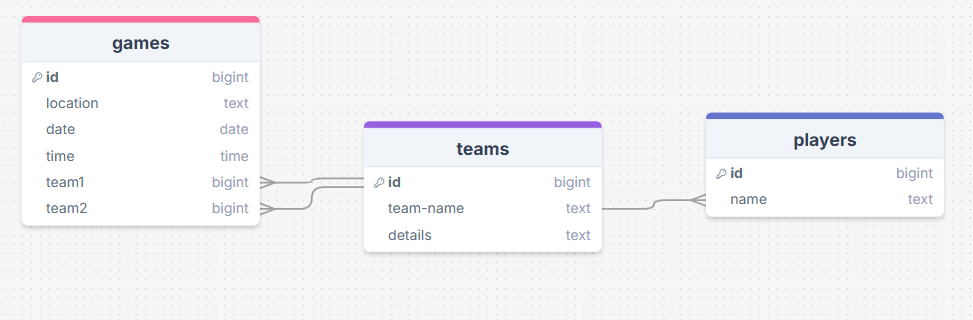

# Sprint 1 - A Working UI Prototype

## Sprint Goals

Develop a prototype that simulates the key functionality of the system, then test and refine it so that it can serve as the model for the next phase of development in Sprint 2.

[Figma](https://www.figma.com/) is used to develop the prototype.

---

## Initial Database Design

This is the initial design for the database linking players to teams 
and games to teams games have the data for when and where the game is and what teams will be playing there the players table holds the players names and the 
teams table stores the team name and details about the team 

---

## UI 'Flow'

The first stage of prototyping was to explore how the UI might 'flow' between states, based on the required functionality.

This Figma demo shows the initial design for the UI 'flow':

<iframe style="border: 1px solid rgba(0, 0, 0, 0.1);" width="500" height="450" src="https://embed.figma.com/proto/lEVdKTzeh7p7tJCxz3VMmh/Untitled?node-id=1-30&p=f&scaling=min-zoom&content-scaling=fixed&page-id=0%3A1&starting-point-node-id=1%3A30&embed-host=share" allowfullscreen></iframe>

### Testing

while testing my end user pointed out if there are lots of teams 
which there will be that it may get harder for them to find the team they are looking for and I fugered the same would happen with the admin panal when wanting t edit the teams infomation also they didn't like the though of someone else knowing where they kid is going be though out the day the end user found on the page where we add a team that im using space the doesn't need to be used and i also came to a relize saion that my website would be best on phone and would requre a good font size 
to read off of a phone 

### Changes / Improvements
I redesign the first page so there was a sech bar with a drop down menu and same for the admin panal and I found a way to free up some more space on the edit or add team page and I removed the ablity for people to see which team the kids are in unlest their an admin by having it only show on a page that only they can get to.

<iframe style="border: 1px solid rgba(0, 0, 0, 0.1);" width="500" height="450" src="https://embed.figma.com/proto/49a3NlBuCJ3h9JossPFUm8/Untitled?node-id=1-2&p=f&scaling=min-zoom&content-scaling=fixed&page-id=0%3A1&embed-host=share" allowfullscreen></iframe>

---

## Initial UI Prototype

The next stage of prototyping was to develop the layout for each screen of the UI.

This Figma demo shows the initial layout design for the UI:

*FIGMA PROTOTYPE - PLACE THE FIGMA EMBED CODE HERE - MAKE SURE IT IS SET SO THAT EVERYONE CAN ACCESS IT*

### Testing

Replace this text with notes about what you did to test the UI flow and the outcome of the testing.

### Changes / Improvements

Replace this text with notes any improvements you made as a result of the testing.

*FIGMA IMPROVED PROTOTYPE - PLACE THE FIGMA EMBED CODE HERE - MAKE SURE IT IS SET SO THAT EVERYONE CAN ACCESS IT*

---

## Refined UI Prototype

Having established the layout of the UI screens, the prototype was refined visually, in terms of color, fonts, etc.

This Figma demo shows the UI with refinements applied:

*FIGMA REFINED PROTOTYPE - PLACE THE FIGMA EMBED CODE HERE - MAKE SURE IT IS SET SO THAT EVERYONE CAN ACCESS IT*

### Testing

Replace this text with notes about what you did to test the UI flow and the outcome of the testing.

### Changes / Improvements

Replace this text with notes any improvements you made as a result of the testing.

*FIGMA IMPROVED REFINED PROTOTYPE - PLACE THE FIGMA EMBED CODE HERE - MAKE SURE IT IS SET SO THAT EVERYONE CAN ACCESS IT*

---

## Sprint Review

Replace this text with a statement about how the sprint has moved the project forward - key success point, any things that didn't go so well, etc.

