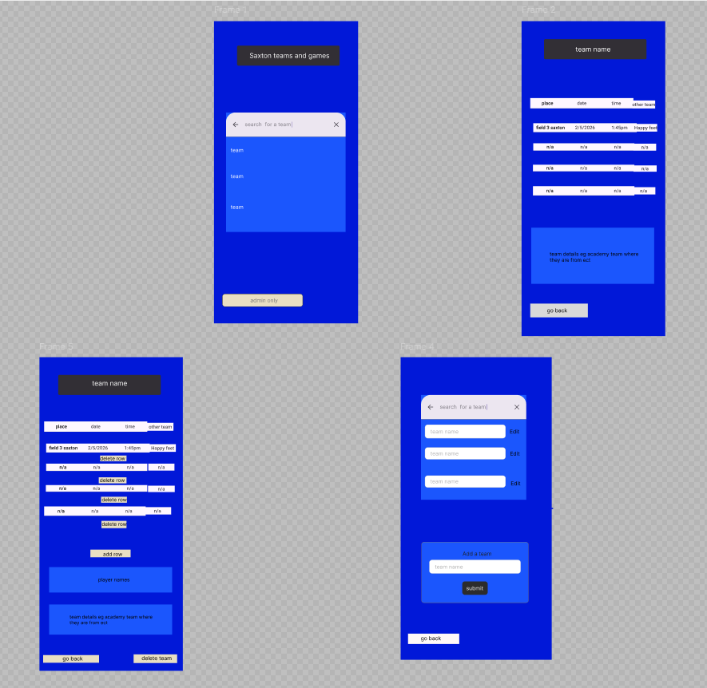
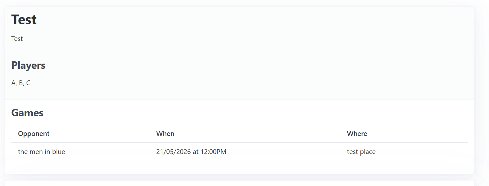
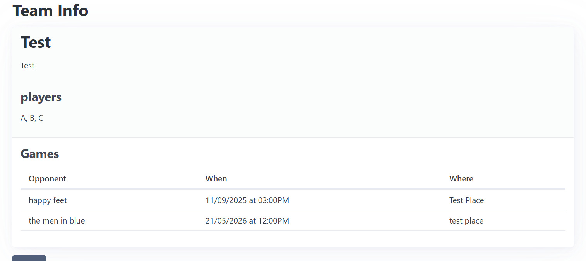
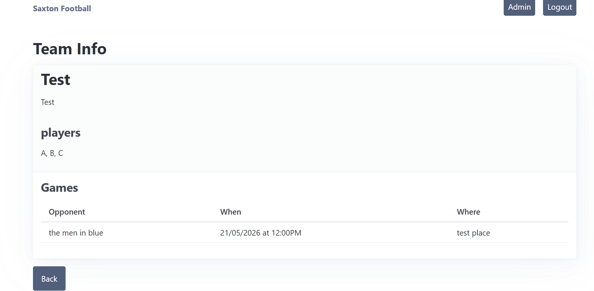

# Sprint 2 - A Minimum Viable Product (MVP)

## Sprint Goals

Develop a bare-bones, working web application that provides the key functionality of the system, then test and refine it so that it can serve as the basis for the final phase of development in Sprint 3.

---

## Implemented Database Schema

so this is what i plan on making my website look like it could turn out different 
byt this is the plain

---

## Initial Implementation

The key functionality of the web app was implemented:
the user can look up what teams are playing what games and the admin can 
add games or teams on the webpage and pass games are stored in the data base but not seen in any of the pages

**PLACE SCREENSHOTS AND/OR ANIMATED GIFS OF THE SYSTEM HERE**

---

## Testing FEATURE NAME HERE

im testing where there the websight only shows games that are happening today or later

seam like it doesn't work on the non admin page 

### Changes / Improvements

i found i miner error in my code that letted this happened but i fixed it 

---

## Testing FEATURE NAME HERE

I was going around making a video of everything working and turns out theres something now working the code breaks when i try add a game

### Changes / Improvements

the date and time that was being input was not the same as it was needing to be storded as 

<video src="screenshots/20251019-2140-29.1374303.mp4" controls title="Title"></video>

---

## Testing FEATURE NAME HERE

testing the admin feacher where others can't use admin stuff

<video src="screenshots/20251019-2119-38.8173391.mp4" controls title="Title"></video>

### Changes / Improvements

i've change the password so no one knows what is and that is's harder to guess

---

## Testing FEATURE NAME HERE

testing that non admin can only open the teams pages to look at the teams

<video src="screenshots/20251019-2123-31.3987008.mp4" controls title="Title"></video>

### Changes / Improvements

i will not change any of this untill i try make it look nice with css

---

## Testing FEATURE NAME HERE

testing that games that are set to before todays date are not showned but are still in the data base

<video src="screenshots/20251019-2147-30.2854021.mp4" controls title="Title"></video>

### Changes / Improvements

looks good to me no need to make changes just yet

---

## Sprint Review

this project now just need some cleaning up and some nice colors

