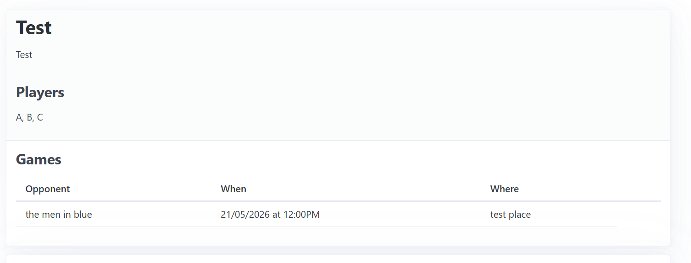
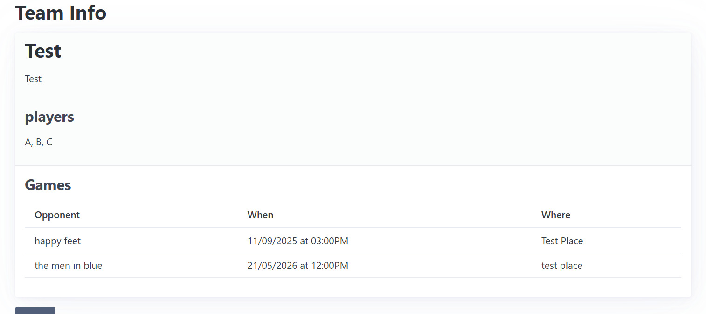
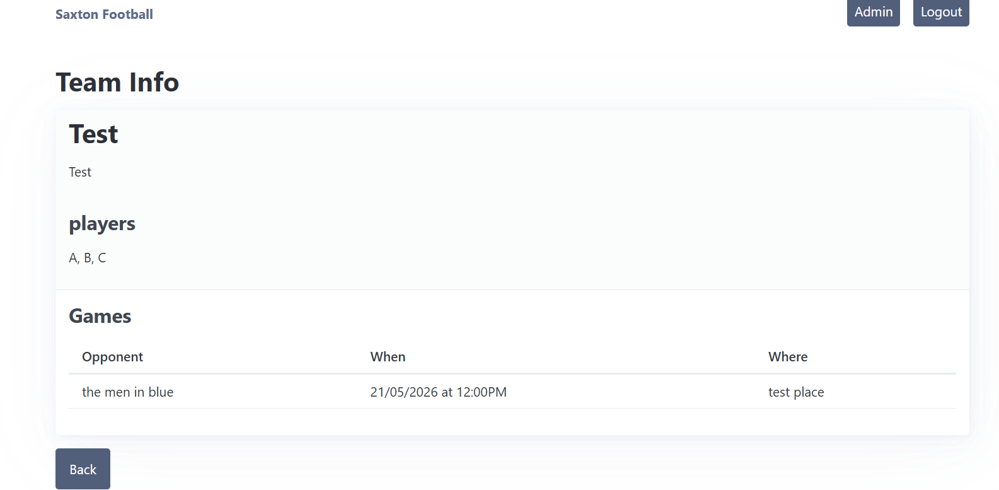

# Sprint 2 - A Minimum Viable Product (MVP)

## Sprint Goals

Develop a bare-bones, working web application that provides the key functionality of the system, then test and refine it so that it can serve as the basis for the final phase of development in Sprint 3.

---

## Implemented Database Schema

Replace this text with notes regarding the DB schema.

---

## Initial Implementation

The key functionality of the web app was implemented:
the user can look up what teams are playing what games and the admin can 
add games or teams on the webpage and pass games are stored in the data base but not seen in any of the pages

**PLACE SCREENSHOTS AND/OR ANIMATED GIFS OF THE SYSTEM HERE**

---

## Testing FEATURE NAME HERE

im testing where there the websight only shows games that are happening today or later

seam like it doesn't work on the non admin page 

### Changes / Improvements

i found i miner error in my code that letted this happened but i fixed it 

---

## Testing FEATURE NAME HERE

i was going around making a video of everything working and turns out theres somthing now working

### Changes / Improvements

Replace this text with notes any improvements you made as a result of the testing.

**PLACE SCREENSHOTS AND/OR ANIMATED GIFS OF THE IMPROVED SYSTEM HERE**

---

## Testing FEATURE NAME HERE

Replace this text with notes about what you are testing, how you tested it, and the outcome of the testing

**PLACE SCREENSHOTS AND/OR ANIMATED GIFS OF THE TESTING HERE**

### Changes / Improvements

Replace this text with notes any improvements you made as a result of the testing.

**PLACE SCREENSHOTS AND/OR ANIMATED GIFS OF THE IMPROVED SYSTEM HERE**

---

## Testing FEATURE NAME HERE

Replace this text with notes about what you are testing, how you tested it, and the outcome of the testing

**PLACE SCREENSHOTS AND/OR ANIMATED GIFS OF THE TESTING HERE**

### Changes / Improvements

Replace this text with notes any improvements you made as a result of the testing.

**PLACE SCREENSHOTS AND/OR ANIMATED GIFS OF THE IMPROVED SYSTEM HERE**

---

## Testing FEATURE NAME HERE

Replace this text with notes about what you are testing, how you tested it, and the outcome of the testing

**PLACE SCREENSHOTS AND/OR ANIMATED GIFS OF THE TESTING HERE**

### Changes / Improvements

Replace this text with notes any improvements you made as a result of the testing.

**PLACE SCREENSHOTS AND/OR ANIMATED GIFS OF THE IMPROVED SYSTEM HERE**

---

## Sprint Review

Replace this text with a statement about how the sprint has moved the project forward - key success point, any things that didn't go so well, etc.

